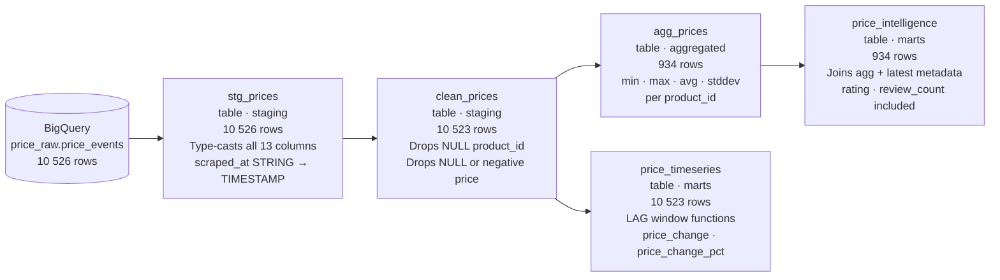

# dbt-transformations

> **Price Intelligence Platform** · Transformation layer  
> dbt (BigQuery) models — staging, cleaning, aggregation, time-series, and final marts for e-commerce price analytics.

[](https://getdbt.com)
[](https://cloud.google.com/bigquery)
[]()
[]()

---

## Overview

All dbt models for the Price Intelligence Platform. Raw price events loaded into BigQuery from GCS are transformed through a four-layer model architecture into analytics-ready tables consumed by the Data Analyst, FastAPI dashboard, and Great Expectations validation.

**Pipeline position:** runs after `export_to_gcs` in the `dbt_transform` Airflow DAG, every 12 hours.

**Downstream consumers:**
- **Data Analyst** — `price_staging.clean_prices` and `price_staging.price_intelligence` (regression, t-test, ANOVA via Papermill notebooks)
- **FastAPI dashboard** — `price_staging.agg_prices` and `price_staging.price_intelligence`
- **Great Expectations** — `price_staging.clean_prices` (14-expectation gate before analytics)

---

## Model Lineage



---

## Repository Structure

```
dbt-transformations/
├── models/
│   ├── staging/
│   │   ├── sources.yml               # BigQuery source: price_raw.price_events
│   │   ├── schema.yml                # Tests + column descriptions: stg_prices, clean_prices
│   │   ├── stg_prices.sql            # Type casts, NULL-safe, all 13 columns incl. rating
│   │   └── clean_prices.sql          # Validated events — primary analytical input
│   ├── aggregated/
│   │   ├── schema.yml                # Tests + descriptions: agg_prices
│   │   └── agg_prices.sql            # min/max/avg/stddev/count per product across all runs
│   └── marts/
│       ├── schema.yml                # Tests + descriptions: price_timeseries, price_intelligence
│       ├── price_timeseries.sql      # LAG: previous_price, price_change, price_change_pct
│       └── price_intelligence.sql    # Final mart: agg + latest metadata + rating
├── tests/                            # Custom dbt singular tests
├── macros/                           # Shared Jinja macros
├── snapshots/                        # SCD Type 2 (future)
├── profiles.yml                      # BigQuery connection config — git-ignored
├── dbt_project.yml                   # Project config, dataset, expiration
├── .gitignore                        # profiles.yml + target/ excluded
└── .github/
    └── workflows/
        └── dbt-ci.yml
```

---

## Model Reference

### `stg_prices` · Staging

**Materialization:** `table` · **Dataset:** `price_staging` · **Rows:** 10,526

Type-casts every column from the raw source. One row per raw event. No filtering at this layer.

```sql
select
    cast(product_id      as string)    as product_id,
    cast(site_name       as string)    as site_name,
    cast(site_product_id as string)    as site_product_id,
    cast(product_name    as string)    as product_name,
    cast(price           as float64)   as price,
    cast(currency        as string)    as currency,
    cast(availability    as string)    as availability,
    cast(category        as string)    as category,
    cast(image_url       as string)    as image_url,
    cast(source_url      as string)    as source_url,
    cast(rating          as float64)   as rating,
    cast(review_count    as int64)     as review_count,
    cast(scraped_at      as timestamp) as scraped_at
from {{ source('price_raw', 'price_events') }}
```

> `scraped_at` is stored as STRING in BigQuery (UTC ISO 8601). The cast to TIMESTAMP happens here — not at source — to avoid BigQuery's ISO 8601 timezone format parsing errors.  
> `rating` and `review_count` are `NULL` for Electroplanet and for Jumia products not yet enriched by `jumia_ratings_enrichment`. Do not cast `NULL` literals here — cast the actual column.

---

### `clean_prices` · Cleaned events

**Materialization:** `table` · **Dataset:** `price_staging` · **Rows:** 10,523

Primary analytical input. Filters corrupt records, normalises text fields.

Filters applied: `product_id IS NOT NULL` and `price IS NOT NULL AND price > 0`.

Ratings coverage: **3,523 rows** have `rating > 0` — available for regression modeling (`price ~ rating + review_count + time`).

---

### `agg_prices` · Per-product statistics

**Materialization:** `table` · **Dataset:** `price_staging` · **Rows:** 934

| Column | Description |
|---|---|
| `product_id` | Primary key — unique per product |
| `min_price` | Lowest observed price (MAD) across all scrape runs |
| `max_price` | Highest observed price (MAD) |
| `avg_price` | Mean price (MAD) |
| `price_stddev` | Standard deviation — `NULL` when only one observation exists |
| `scrape_count` | Total number of times this product was observed |

---

### `price_timeseries` · Price movement

**Materialization:** `table` · **Dataset:** `price_staging` · **Rows:** 10,523

Same grain as `clean_prices`. Adds LAG window functions partitioned by `product_id`, ordered by `scraped_at`.

| Column | Description |
|---|---|
| `previous_price` | Price from the immediately preceding scrape run. `NULL` for first observation. |
| `price_change` | `price - previous_price` in MAD. Positive = price increase. |
| `price_change_pct` | `price_change / previous_price * 100`. `NULL` when `previous_price` is `NULL`. |

---

### `price_intelligence` · Final mart

**Materialization:** `table` · **Dataset:** `price_staging` · **Rows:** 934

One row per product. Joins `agg_prices` with the latest product metadata (name, category, site, rating). Primary table consumed by the dashboard and Data Analyst.

| Column | Description |
|---|---|
| `product_id` | Primary key |
| `product_name` | Title from the most recent scrape |
| `category` | Product category |
| `site_name` | Source: `jumia_ma` or `electroplanet` |
| `avg_price` | Mean price (MAD) |
| `min_price` · `max_price` | Price range (MAD) |
| `rating` | Latest known rating (0–5). `NULL` for Electroplanet. |
| `review_count` | Latest known review count. `NULL` when rating is `NULL`. |
| `scrape_count` | Total observations |

---

## Installation

```bash
git clone https://github.com/HybridEcomPricePlatform-Org/dbt-transformations.git
cd dbt-transformations

pip install dbt-bigquery==1.5.3
```

### Configure `profiles.yml` (git-ignored)

```yaml
price_intel:
  target: dev
  outputs:
    dev:
      type: bigquery
      method: service-account
      project: price-intel-prod
      dataset: price_staging
      location: EU
      keyfile: "<absolute-path-to-service-account.json>"
      threads: 4
      timeout_seconds: 300
```

---

## Commands

```bash
# Verify connection to BigQuery
dbt debug --profiles-dir .

# Compile SQL without executing
dbt compile --profiles-dir .

# Run all models
dbt run --profiles-dir .

# Run a specific model and all downstream
dbt run --select clean_prices+ --profiles-dir .

# Run tests
dbt test --profiles-dir .

# Generate documentation catalogue
dbt docs generate --profiles-dir .

# Serve docs (port 8082 — port 8080 is Airflow)
dbt docs serve --port 8082 --profiles-dir .
```

---

## Tests

Defined in `schema.yml` files across all layers. **Current result: PASS=15 WARN=0 ERROR=0**

| Model / Source | Test | Column |
|---|---|---|
| `price_raw.price_events` | `not_null` | `product_id`, `price`, `site_name`, `scraped_at` |
| `price_raw.price_events` | `accepted_values` | `site_name` ∈ `['jumia_ma', 'electroplanet']` |
| `clean_prices` | `not_null` | `product_id`, `price`, `site_name` |
| `clean_prices` | `accepted_values` | `availability` ∈ `['in_stock', 'out_of_stock', 'unknown']` |
| `agg_prices` | `not_null` + `unique` | `product_id` |
| `price_intelligence` | `not_null` + `unique` | `product_id` |

---

## `dbt_project.yml` — Key Configuration

```yaml
name: 'dbt_price'
version: '1.0.0'

models:
  dbt_price:
    +hours_to_expiration: 1440    # 60 days — required for BigQuery sandbox free tier
    staging:
      +materialized: table        # Sandbox does not support expiration_timestamp on views
    aggregated:
      +materialized: table
    marts:
      +materialized: table
```

> In a billing-enabled BigQuery project, revert staging models to `materialized: view` — that is the dbt convention. The `table` materialisation is a sandbox constraint only.

---

## Documentation

All 5 models fully documented with descriptions at model and column level.

```
stg_prices          model: OK  cols described: 6/6
clean_prices        model: OK  cols described: 7/7
agg_prices          model: OK  cols described: 6/6
price_timeseries    model: OK  cols described: 6/6
price_intelligence  model: OK  cols described: 10/10
```

> `catalog.json` column `comment` fields are `NULL` — expected. BigQuery does not propagate dbt descriptions into `INFORMATION_SCHEMA` automatically. Column descriptions display correctly in the dbt docs UI, sourced from `manifest.json`. The `table_owner` RuntimeWarning from `dbt docs generate` is a known harmless bug in the dbt-bigquery adapter.  
> `target/` is git-ignored — regenerate with `dbt docs generate`, never commit.

---

## Running via Airflow

In production, dbt runs via SSH from the Airflow container to the host machine:

```bash
# Executed by run_dbt BashOperator
cd $PRICE_INTEL_HOME/dbt_price && \
source $PRICE_INTEL_HOME/venv/bin/activate && \
dbt run --profiles-dir . 2>&1
```

DAG: `dbt_transform` · Schedule: `0 */12 * * *`  
Task chain: `wait_for_scraping` → `run_dbt` → `validate_great_expectations` → `run_all_analytics_notebooks`

---

## CI/CD

GitHub Actions — `.github/workflows/dbt-ci.yml`  
Triggers on push to `main`, `develop`, and on pull requests to `main`.

| Job | What it checks |
|---|---|
| `validate-dbt` | Project structure + SQL syntax via `dbt compile` (dry run against schema) |
| `lint-sql` | SQLFluff with BigQuery dialect |

---

## Related Repositories

| Repo | Description |
|---|---|
| [`scrapers`](https://github.com/HybridEcomPricePlatform-Org/scrapers) | Produces raw price data → MongoDB → GCS |
| [`airflow-dags`](https://github.com/HybridEcomPricePlatform-Org/airflow-dags) | Orchestrates dbt runs + Great Expectations gate |
| [`nifi-flows`](https://github.com/HybridEcomPricePlatform-Org/nifi-flows) | Streaming channel — Kafka → GCS |
| `analytics` | Jupyter notebooks — consumes `price_staging` tables |

---

*HybridEcomPricePlatform-Org · Data Engineering Portfolio Project · FST Tanger 2025–2026*
